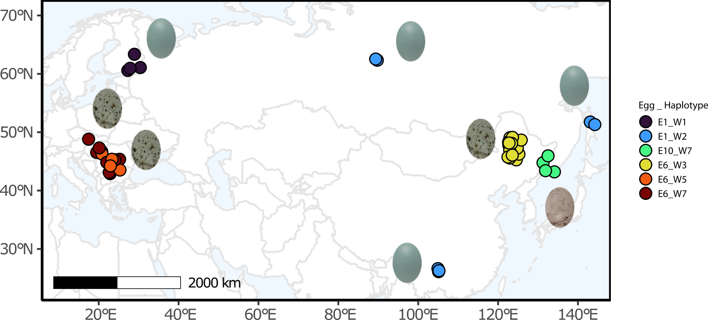

# Mutational basis of mimetic eggs

The scripts in order:

1. Subset samples for GWAS / FST 
2. Refilter the VCF ensuring appropriate ploidy
3. Annotate synonymous / nonsynonymous SNPs
4. Calculate FST base-pair between egg:haplotypes
5. Identify candidates from the FST output (massive!)
6. Alternative approach including all eggs and males, prep VCF for GWAS
7. Create covariates file for GWAS from population structure
8. Run GWAS using GEMMA
9. Identify candidates and plot GWAS. 

The large .txt.gz file provides the fixed SNPs across contrasts for females, and is referred to as "FST1_TIDY_2024APR4.txt" in the scripts. 

The female samples (n=47) which include nestlings with an observed egg phenotype, requiring at least 4 females for the analysis. 

